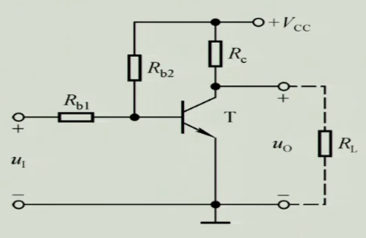
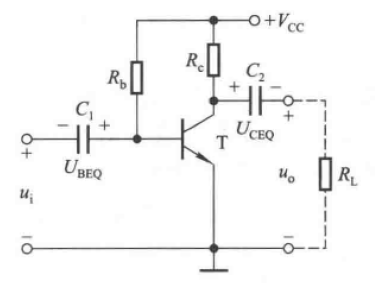
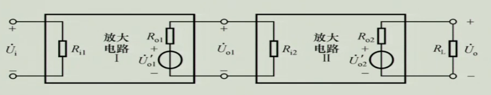
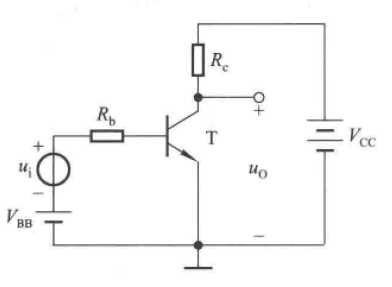
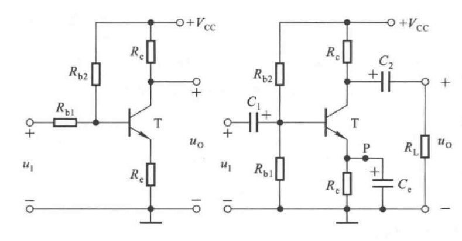
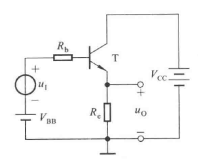
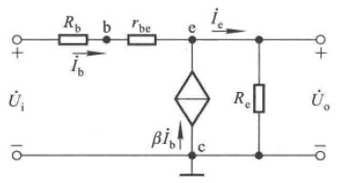
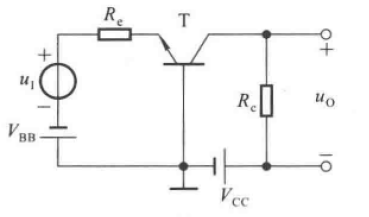
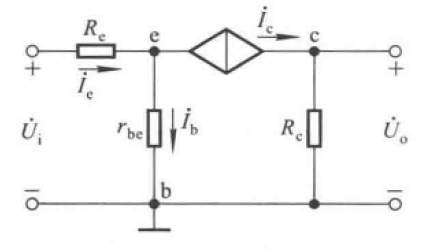

# 2.1 放大电路的构成

## 2.1.1 放大的概念

1. 基本特征：功率放大

2. 本质：能量的控制、转换

3. 必要条件：有源元件

4. 前提条件：不失真

5. 测试信号：正弦波

## 2.1.2 怎样构建基本放大电路

### 一、目标

小功率信号 -> 大功率信号

### 二、条件

1. 有源元件

2. 电源

### 三、技术路线

1. 三极管：放大状态

2. 小信号：控制$i_B$（$U_{BE}$）
3. 合理的输出

### 四、放大电路

#### 1. 直接耦合

#### 2. 阻容耦合

### 五、工作原理

以阻容耦合为例：

$u_i$变化导致$u_{BE}$变化，根据$\large i_B={{u_{CC}-u_{BE}} \over R_B}$，$i_B$发生变化，从而根据$i_C=\beta i_B$导致$i_C$变化，继而由$u_{CE}=u_{CC}-i_CR_C$导致$U_{CE}$变化，最终$u_o$变化。

# 2.2 性能指标

## 一、等效示意图

## 二、放大倍数

$A_{uu}$

$A_{ui}$

$A_{iu}$

$A_{ii}$

## 三、输入电阻

$R_i$

## 四、输出电阻

$R_o$

## 五、通频带

## 六、非线性失真

## 七、最大不失真输出电压

## 八、最大输出功率与效率

# 2.3 分析方法

## 2.3.1 直流通路与交流通路

### 一、直流通路

交流源短路

电容断路

### 二、交流通路

直流源接地

电容短路

## 2.3.2 图解法

## 2.3.3 等效电路分析法

### 一、直流通路

1. Q点
2. $\Large r_{be}=r_{bb\prime}+(1+\beta){U_T \over I_{EQ}}$

### 二、交流通路

1. 化为交流通路
2. 化简的等效h模型

### 三、分析基本共射放大电路

#### 1.直流分析

$$\Large I_{BQ}={{U_{BB}-U_{BEQ}} \over R_b}$$

$$\Large I_{CQ}=\beta I_{BQ}$$

$$\Large U_{CEQ}=U_{CC}-I_{CQ}\cdot R_C$$

**判断工作点是否处于放大区**$$U_{CEQ}>U_{BEQ}$$

#### 2.交流分析

$$\Large r_{be}=r_{bb\prime}+(1+\beta){U_T \over I_{EQ}} \approx r_{bb\prime}+(1+\beta){U_T \over I_{CQ}}$$

$$\Large A_u={u_o \over u_i}={{-\beta \cdot i_b \cdot R_c} \over {i_b \cdot (r_{be}+R_b)}}$$

$$\Large R_i=R_b+r_{be}$$

$$\Large R_o=R_c$$

# 2.4 放大电路Q点的稳定

## 2.4.1 必要性

### 一、影响因素

1. 温度
2. 电源纹波
3. 元器件老化

### 二、稳定的思路

温度升高，$I_{CQ}$升高，$U_{CEQ}$降低，$I_{CQ}$受$I_{B}$影响，必须降低$I_B$补偿$I_{CQ}$

## 2.4.2 Q点稳定电路（射极带电阻）

### 一、构成

### 二、分析

#### 1.直流分析

$$\Large U_{BQ}=V_{CC} \cdot {R_{b1} \over {R{b1}+R{b2}}}$$

$$\Large I_{EQ}={{U_{BQ}-U_{BEQ}} \over R_e}$$

$$\Large U_{CEQ}=V_{CC}-I_{CQ} \cdot R_c-I_{EQ} \cdot R_e$$

$$\Large I_{BQ}={I_{EQ} \over 1+\beta}$$

#### 2.交流分析

$$\Large r_{be}=r_{bb\prime}+(1+\beta){U_T \over I_{EQ}} \approx r_{bb\prime}+(1+\beta){U_T \over I_{CQ}}$$

$$\Large R_i=R_{b1} \parallel R_{b2} \parallel r_{be}$$

$$\Large R_o=R_c$$

# 2.5 晶体管放大电路的三种基本接法

## 2.5.1 基本共集放大电路（射极跟随器）

### 一、结构

### 二、分析

#### 1.直流分析

$$\Large V_{BB}=I_{EQ}R_E+U_{BEQ}+I_{BQ}R_b$$

$$\Large I_{BQ}={{V_{BB}-U_{BEQ}} \over {R_b+(1+\beta)R_e}}$$

$$\Large U_{CEQ}=V_{CC}-I_{EQ}R_e$$

#### 2.交流分析

$$\Large r_{be}=r_{bb\prime}+(1+\beta){U_T \over I_{EQ}} \approx r_{bb\prime}+(1+\beta){U_T \over I_{CQ}}$$

$$\Large A_u={u_o \over u_i}={{i_e \cdot R_e} \over {i_e \cdot R_e+i_b(R_b+r_{be})}} \approx 1 \lt 1$$

$$\Large R_i={U_i \over I_i}={{I_b(R_b+r_{be})+I_eR_e} \over I_b}=R_b+r_{be}+(1+\beta)R_e$$

$$\Large R_o={U_o \over I_o}={U_o \over {(1+\beta){U_o \over R_b+r_{be}}+{U_o \over R_e}}}=R_e \parallel {{R_b+r_{be}\over 1+\beta}}$$

#### 3.结论

电压增益约为1

电流增益大

输入电阻大，输出电阻小

## 2.5.2 基本共基放大电路

### 一、构成

### 二、分析

#### 1.直流分析

$$\Large U_{EQ}=-U_{BE}$$

$$\Large U_{CQ}=V_{CC}-I_{CQ}R_c$$

$$\Large I_{EQ}={{V_{BB}-U_{BEQ}}\over {R_e}}$$

$$\Large I_{BQ}={I_{EQ}\over {1+\beta}}$$

$$\Large U_{CEQ}=U_{CQ}-U_{EQ}=V_{CC}-I_{CQ}R_c+U_{BEQ}$$

#### 2.交流分析

$$\Large r_{be}=r_{bb\prime}+(1+\beta){U_T \over I_{EQ}} \approx r_{bb\prime}+(1+\beta){U_T \over I_{CQ}}$$

$$\Large A_{u}={u_o \over u_i}={{\beta i_b(R_c \parallel R_L)} \over {i_br_{be}+i_eR_e}}={{\beta (R_c \parallel R_L)} \over {r_{be}+(i+\beta)R_e}}$$

$$\Large R_i={U_i \over I_i}={{i_eR_e+i_br_{be}}\over i_e}=R_e+{r_be \over {1+\beta}}$$

$$\Large R_o=R_c$$

#### 3.结论

$R_e$足够小时放大性能类似于共射放大器

通频带很宽,是共射放大器的$i+\beta$倍

# 2.6 场效应管放大电路

# 2.7 派生电路