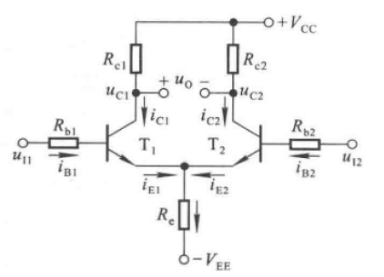

# 3.1 多级放大电路的一般问题

## 3.1.1 多级放大电路的耦合方式

### 一、直接耦合

#### 1.缺点

调试不便

Q点漂移

#### 2.优点

低频特性好

易于集成

### 二、阻容耦合

#### 1.缺点

低频特性差

电容不易于集成

#### 2.优点

便于调试

Q点稳定

### 三、变压器耦合

#### 1.缺点

低频特性差

不易集成

#### 2.优点

便于调试

可放大负载电阻

### 四、光电耦合

#### 优点

抗干扰能力强

电气隔离

## 3.1.2 多级放大电路的动态分析

前级输出电阻为后级输入电阻

# 3.2 集成运算放大器电路概述

## 3.2.1 集成运放的电路结构特点

1. 直接耦合，避免使用电容
2. 采用**差分放大电路**与**恒流源电路**
3. 允许使用复杂电路
4. 使用有源器件取代电阻
5. 采用复合管

## 3.2.2 集成运放电路的组成及其各部分的作用

### 一、输入级

高性能**差分放大电路**

输入电阻高

电压放大倍数大

抑制零点漂移

### 二、中间级

共射/共源放大电路

使用复合管

**恒流源**作为集电极负载

### 三、输出级

**互补输出**电路

输出电压线性范围宽

输出电阻小

非线性失真小

### 四、偏置电路

**电流源**

# 3.3 集成运放中的单元电路

## 3.3.1 直接耦合放大电路的零点漂移

### 一、产生原因

温漂

### 二、抑制方法

射极电阻

温度补偿

## 3.3.2 差分放大电路

### 一、电路的构成

共模信号

差模信号

### 二、长尾式差分放大电路

### 三、四种接法

## 3.3.3 电流源电路

### 一、镜像电流源

#### 1.结构

#### 2.分析

$$\Large I_R=I_C+2I_B=I_C+2\cdot{I_C\over\beta}$$

$$\Large I_C={\beta\over \beta+2}I_R \approx I_R$$

#### 3.结论

输出电流高时，R上功耗大

输出电流低时，R的数值很大，不利于集成

### 二、比例电流源（实现大电流）

#### 1.结构

#### 2.分析

$$\Large I_{E0}R_{e0}+U_{BE0}=I_{E1}R_{e1}+U_{BE1}$$

$$\Large U_{BE0} \approx U_{BE1}$$

$$\Large I_{E0}R_{e0} \approx I_{E1}R_{e1}$$

$$\Large \beta \gg 2, I_C \approx I_E$$

$$\Large I_{C1} \approx {R_{e0}\over R_{e1}}\cdot I_R$$

### 三、微电流源（实现小电流）

#### 1.结构

#### 2.分析

$$\Large U_{BE0}=I_{E1}R_{e}+U_{BE1}$$

$$\Large I_{E1}={U_{BE0}-U_{BE1}\over R_e}$$

$$\Large I_{C1}\approx {U_T\over R_e}\ln{I_R\over I_{C1}}$$

### 四、加射极输出器的电流源

#### 1.结构

#### 2.分析

$$\Large I_{C1}=I_{C0}=I_R-I_{B2}=I_R-{I_{E2}\over 1+\beta}=I_R-{2I_{C1}\over (1+\beta)\cdot\beta}$$

$$\Large I_{C1}\approx I_R$$

#### 3.结论

减小了基极电流对$I_R$的分流，输出与$I_R$保持很好的镜像关系

### 五、威尔逊电流源

#### 1.结构

#### 2.分析

$$\Large I_{E2}=I_{C1}+2I_{B1}$$

$$\Large I_C={\beta\over\beta+2}\cdot I_{E2}={\beta+1\over\beta+2}\cdot I_{C2}$$

$$\Large I_R=I_{B2}+I_C={\beta^2+2\beta+2 \over \beta^2+2\beta}\cdot I_{C2}$$

$$\Large I_{C2}=(1-{2\over{\beta^2+2\beta+2}})I_R \approx I_R$$

#### 3.结论

$T_0$与$T_1$构成镜像电流源，等效电阻很大，充当$T_2$的射极电阻以稳定Q点

### 六、有源负载共射放大电路

#### 1.结构

#### 2.分析

$$\Large I_R={V_{CC}-U_{EB3}\over R}$$

$$\Large I_{CQ1}=I_{C2}={\beta \over \beta+2}\cdot I_R={\beta \over \beta+2}\cdot {V_{CC}-U_{EB3}\over R}$$

### 七、有源负载差分放大电路

#### 1.结构

#### 2.分析

##### 差模信号

$$i_{D1}=-i_{D2}=I_{D3}=I_{D4}$$

$$i_O=i_{D4}-i_{D2}=2i_{D1}$$

##### 共模信号

$$i_{D1}=i_{D2}=I_{D3}=I_{D4}$$

$$i_O=i_{D4}-i_{D2}=0$$

## 3.3.4 直接耦合互补输出级

### 一、基本要求

输出电阻小

功率加大

输出电压不失真

### 二、基本电路

### 三、消除交越失真的互补输出级电路

