# 4.1 基本概念及判断

## 4.1.1 基本概念

### 一、反馈

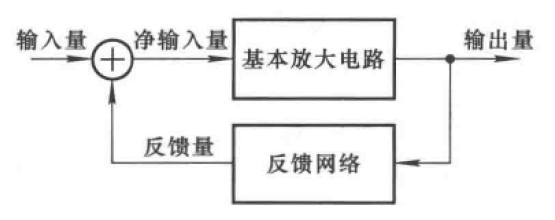

### 二、正反馈与负反馈

#### 1.正反馈

反馈量增强了输入量

#### 2.负反馈

反馈量减小了输入量

### 三、直流反馈与交流反馈

#### 1.直流反馈

直流通路里存在反馈

#### 2.交流反馈

交流通路里存在反馈

## 4.1.2 反馈的判断

### 一、反馈的存在与否

1. 结构上

2. 反馈量

### 二、反馈的极性

#### 瞬时极性法

1. 在输入端加$\large \oplus$
2. 判断输出量
3. 输出量作为信号源，判断输入端响应
4. 输入端$\large \oplus$，正反馈；输入端$\large \ominus$，负反馈

### 三、交直流反馈

# 4.2 负反馈放大电路的四种基本组态

## 4.2.1 判别

### 一、输出端

电压负反馈

电流负反馈

### 二、串并联反馈

串联负反馈

并联负反馈

## 4.2.2 四种组态

### 一、电压串联负反馈

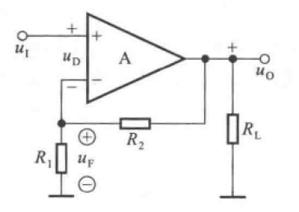

#### 负反馈

**输入增加**，净输入增加，输出增加，反馈至反向输出端增加，**净输入减少**

#### 串联

输入增加至同向输入端，反馈增加至反向输入端，**端子不同**

#### 电压反馈

**$R_L$短路时**，输出接地，反馈为0，**反馈不存在**

#### 特性

输出电压转换为反馈电压

$$\Large u_F={R_1\over R_1+R_2}\cdot u_o$$

### 二、电流串联负反馈

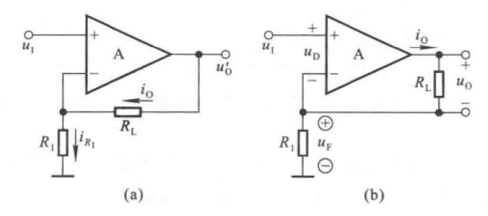

#### 负反馈

**输入增加**，净输入增加，输出增加，反馈至反向输出端增加，**净输入减少**

#### 串联

输入增加至同向输入端，反馈增加至反向输入端，**端子不同**

#### 电流反馈

**$R_L$短路时**，输出接输入端，**反馈仍存在**

#### 特性

输出电流转化为反馈电压

$$\Large u_F=i_OR_1$$

### 三、电压并联负反馈

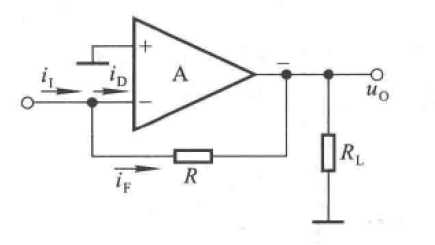

#### 负反馈

**输入增加**，净输入增加，输出增加，反馈至反向输出端增加，**净输入减少**

#### 并联

输入增加至反向输入端，反馈增加至反向输入端，**端子相同**

#### 电压反馈

**$R_L$短路时**，输出接地，反馈为0，**反馈不存在**

#### 特性

输出电压转化为反馈电流

$$\Large i_F=-{u_O\over R}$$

### 四、电流并联负反馈

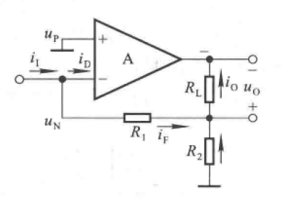

#### 负反馈

**输入增加**，净输入增加，输出增加，反馈至反向输出端增加，**净输入减少**

#### 并联

输入增加至反向输入端，反馈增加至反向输入端，**端子相同**

#### 电流反馈

**$R_L$短路时**，输出接输入端，**反馈仍存在**

#### 特性

输出电流转换为反馈电流

$$\Large i_F=-{R_2\over R_1+R_2}\cdot i_o$$

# 4.3 方块图及一般表达式

## 4.3.1 负反馈放大电路的方块图表示法

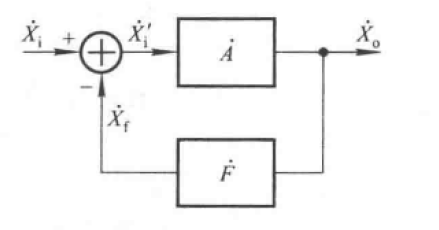

### 闭环放大倍数

$$\Large A_f={X_o \over X_i}={AX_i' \over X_i'+X_f}={AX_i' \over X_i'+FAX_i'}={A \over 1+AF}$$

### 环路放大倍数

$$\Large AF={X_f \over X_i'}$$

### 反馈深度

$$\Large \left\vert 1+AF \right\vert$$

## 4.3.2 四种组态电路的方块图

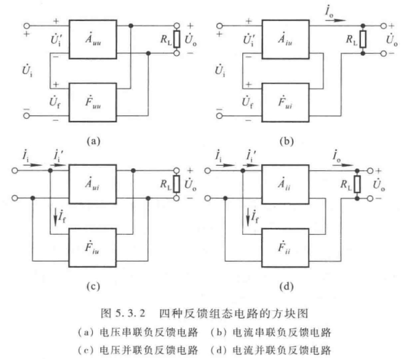

| 反馈组态 |               $A$                |               $F$               |              $A_f$               |          功能          |
| :------: | :------------------------------: | :-----------------------------: | :------------------------------: | :--------------------: |
| 电压串联 | $\Large A_{uu}={U_o \over U_i'}$ | $\Large F_{uu}={U_f \over U_o}$ | $\Large A_{uuf}={U_o \over U_i}$ | 电压控制电压，电压放大 |
| 电流串联 | $\Large A_{iu}={I_o \over U_i'}$ | $\Large F_{ui}={U_f \over I_o}$ | $\Large A_{iuf}={I_o \over U_i}$ |      电压控制电流      |
| 电压并联 | $\Large A_{ui}={U_o \over I_i'}$ | $\Large F_{iu}={I_f \over U_o}$ | $\Large A_{uif}={U_o \over I_i}$ |      电流控制电压      |
| 电流并联 | $\Large A_{ii}={I_o \over I_i'}$ | $\Large F_{ii}={I_f \over I_o}$ | $\Large A_{iif}={I_o \over I_i}$ | 电流控制电流，电流放大 |

# 4.4 深度负反馈放大电路分析

## 4.4.1 深度负反馈的实质

在近似分析中忽略净输入量

## 4.4.2 反馈网络的分析

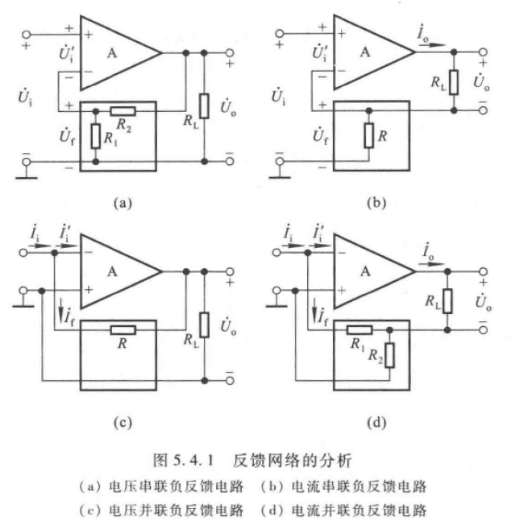

### 一、电压串联

$\Large F_{uu}={U_f \over U_o}={R_1\over R_1+R_2}$

$\Large A_{uuf}\approx {U_o \over U_f}={R_1+R_2 \over R_1}$

$\Large U_o={R_1+R_2 \over R_1}\cdot U_i$

### 二、电流串联

$\Large F_{ui}={U_f \over I_o}={I_oR \over I_o}=R$

$\Large A_{iuf} \approx {I_o \over U_f}={1 \over R}$

$\Large A_{uuf}={U_o \over U_i}={I_oR_L \over I_oR}={R_L \over R}$

$\Large U_o={R_L \over R}\cdot U_i$

### 三、电压并联

$\Large F_{iu}={I_f \over U_o}={{-U_o \over R}\over U_o}=-{1\over R}$

$\Large A_{uif} \approx {U_o \over I_f}={-i_fR \over i_f}=-R$

$\Large A_{usf}={U_o \over U_s}={U_o \over i_fR_s}={-i_fR \over i_fR_s}=-{R \over R_s}$

$\Large U_o=-{R \over R_s}\cdot U_i$

### 四、电流并联

$\Large F_{ii}={I_f \over I_o}={-{R_2 \over R_1+R_2}I_o \over I_o}=-{R_2 \over R_1+R_2}$

$\Large A_{iif} \approx {I_o \over I_f}=-{R_1+R_2 \over R_2}$

$\Large A_{usf}={U_o \over U_s}={I_oR_L \over I_fR_s}=-{R_1+R_2 \over R_2}\cdot {R_L\over R_s}$

$\Large U_o=-{R_1+R_2 \over R_2}\cdot {R_L\over R_s}\cdot U_i$

# 4.5 负反馈对放大电路性能的影响

## 4.5.1 稳定放大倍数

$\Large A_f={A \over 1+AF}$

$\Large dA_f = {1\cdot(1+AF)-AF \over (1+AF)^2}dA={1 \over (1+AF)^2}dA$

$\Large {dA_f \over A_f} = {{1 \over (1+AF)^2}dA \over A_f}={1 \over 1+AF}{dA \over A}$

稳定性提高(1+AF)倍

## 4.5.2 改变输入输出电阻

### 一、对输入电阻

#### 1.串联

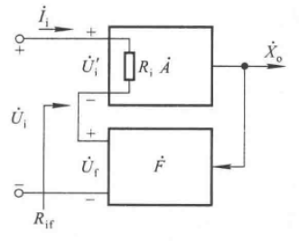

$\Large R_{if}={U_i \over I_i}={U_i'+AFU_i' \over I_i}=(1+AF)R_i$

#### 2.并联

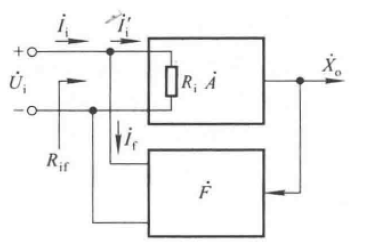

$\Large R_{if}={U_i \over I_i}={U_i\over (1+AF)I_i'}={R_i \over (1+AF)}$

### 二、对输出电阻

#### 1.电压

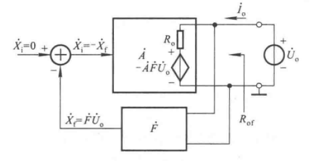

$\Large R_{of}={U_o \over I_o}={U_o \over {U_o-(-AFU_o)\over R_o}}={R_o \over 1+AF}$

#### 2.电流

$\Large R_{of}=(1+AF)R_o$

## 4.5.3 展宽频带

展宽(1+AF)倍

## 4.5.4 减小非线性失真

## 4.5.5 放大电路引入负反馈的一般原则

# 4.6 负反馈放大电路的稳定性

## 4.6.1 负反馈放大电路自激振荡产生的原因和条件

### 一、原因

中频段：$\Large \left\vert X_i'\right\vert = \left\vert X_i\right\vert -\left\vert X_f\right\vert $

在低频段或高频段时，某一频率信号使得A与F的相移产生超前或滞后180°，使得$\Large \left\vert X_i'\right\vert = \left\vert X_i\right\vert +\left\vert X_f\right\vert $

### 二、平衡条件

$\Large \left\vert AF \right\vert \ge 1$

$\Large \varphi_A+\varphi_F=(2n+1)\pi$

## 4.6.2 负反馈放大电路稳定性的定性分析

单级放大电路：最大相移-90°，不可能自激振荡

两级放大电路：最大相移-180°，在-180°时A=0，不可能自激振荡

三级放大电路：最大相移-270°，可能产生自激振荡

反馈越深，满足赋值条件的可能性越大，产生自激振荡的可能性越大

## 4.6.3 负反馈放大电路稳定性的判断

若不存在使$\varphi_A+\varphi_F=180°$的$f_0$，则电路稳定

若存在$f_0$，且小于使$20lg\left\vert AF \right\vert=0$的$f_c$，则电路不稳定，必然产生自激振荡；若大于$f_c$，则电路稳定

## 4.6.4 负反馈放大电路自激振荡的消除

### 一、滞后补偿

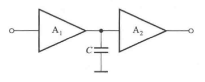

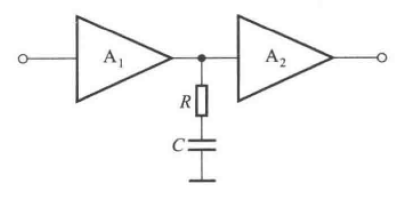

### 二、超前补偿

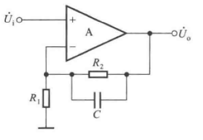
