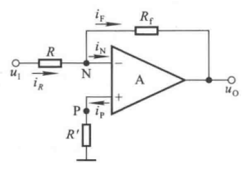
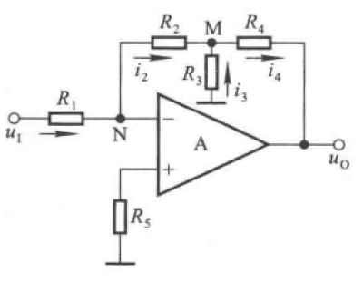
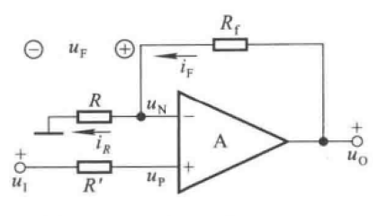
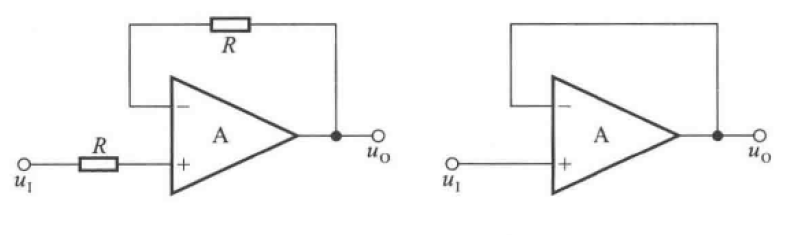
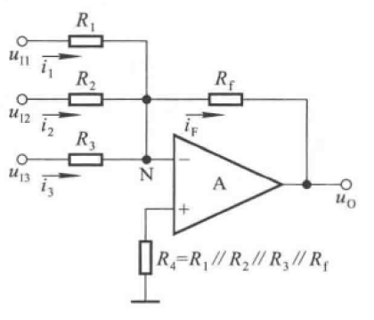
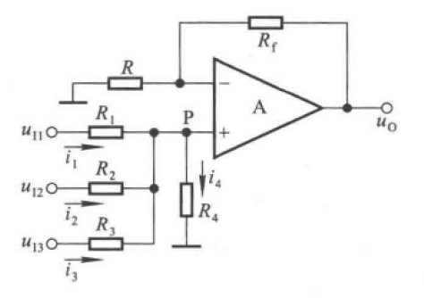
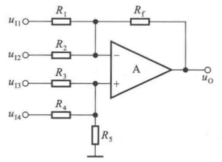
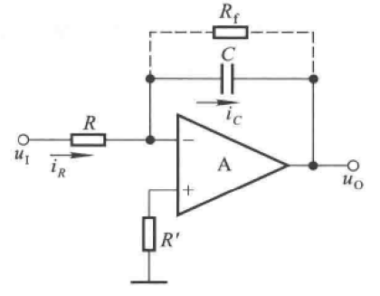
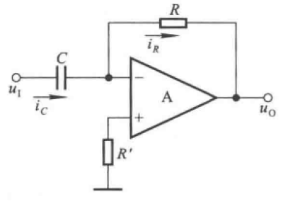

# 5.1 基本运算电路

## 5.1.1 概述

### 一、电压负反馈

### 二、虚短、虚断

## 5.1.2 比例运算电路

### 一、反向比例运算电路

#### 1.基本电路

**结构**

**分析**

$\Large u_N=u_P=0$

$\Large i_P=i_N=0$

$\Large i_R=i_f$

$\Large {u_I-u_N \over R}={u_N-u_O \over R_f}$

$\Large u_O=-{R_f \over R}u_i$

$\Large R_O=\infty$

$\Large R_i={U_I\over i_R}=R$

为增大电路输入电阻，需要增大R，而为保证放大倍数不变，需要同时增大$R_f$，电阻过大不易集成且稳定性差

#### 2.T形网络电路

**结构**

**分析**

$\Large {u_I \over R_1}=-{u_M \over R_2}$

$\Large u_M=-{R2 \over R1}u_I$

$\Large i_3=-{u_M\over R_3}={R_2 \over R1R3}u_I$

$\Large i_4=i_2+i_3$

$\Large u_O=-i_2R_2-i_4R_4=-{R2+R4 \over R1}(1+{R2\parallel R4 \over R3})u_I$

### 二、同向比例运算电路

#### 1.结构

#### 2.分析

$\Large u_P=u_N=u_I$

$\Large {u_N \over R}={u_O-u_N \over R_f}$

$\Large u_O=(1+{R_f \over R})u_N = (1+{R_f \over R})u_I$

### 三、电压跟随器

#### 1.结构

#### 2.分析

$\Large u_I=u_O$

## 5.1.3 加减运算电路

### 一、求和电路

#### 1.反向求和电路

**结构**

**分析**

$\Large i_1+i_2+i_3=i_f$

$\Large {u_{I1} \over R_1}+{u_{I2} \over R_2}+{u_{I3} \over R_3}=-{u_O \over R_f}$

$\Large u_O=-R_f({u_{I1} \over R_1}+{u_{I2} \over R_2}+{u_{I3} \over R_3})$

#### 2.同向求和电路

**结构**

**分析**

$\Large u_O=R_f({u_{I1} \over R_1}+{u_{I2} \over R_2}+{u_{I3} \over R_3})$

### 二、加减运算电路

#### 1.结构

#### 2.分析

$\Large u_O=R_f({u_{I3} \over R_3}+{u_{I4} \over R_4}-{u_{I1} \over R_1}-{u_{I2} \over R_2})$

## 5.1.4 积分运算电路和微分运算电路

### 一、积分运算电路

#### 1.结构

#### 2.分析

$\Large i_C=i_R={u_1 \over R}$

$\Large u_O=-u_C$

$\Large u_O=-{1 \over C}\int i_c{\rm d}t={1 \over RC}\int u_I{\rm d}t$

### 二、微分运算电路

#### 1.结构

#### 2.分析

$\Large i_R=i_C=C{du_I \over dt}$

$\Large u_O=-i_RR=-RC{du_I \over dt}$

