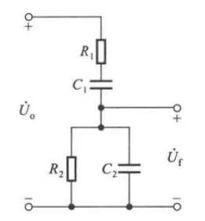
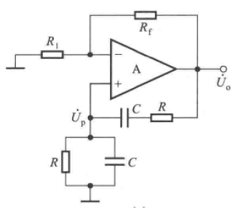
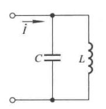
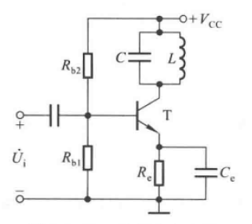
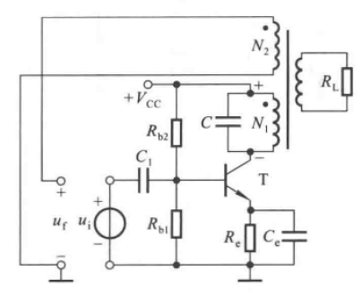

# 6.1 正弦波振荡电路

## 6.1.1 概述

### 一、产生条件

#### 1.起振条件

$\left\vert AF \right\vert >1$

#### 2.平衡条件

$\left\vert AF \right\vert =1$

$\varphi_A + \varphi_F = 2n\pi$

### 二、电路组成

放大电路

正反馈

选频电路

稳幅电路

### 三、判别

1. 组成电路齐全
2. 放大电路能否正常工作
3. 是否存在正反馈 相位平衡条件
4. 能否起振

## 6.1.2 RC振荡电路（文氏电桥振荡器）

### 一、放大电路

$\Large A_u={U_o \over U_p} = 1+{R_f \over R}$

### 二、选频网络

$\Large F={U_f \over U_o} = {R \parallel {1 \over j\omega C} \over R+{1 \over j\omega C} + R\parallel {1 \over j\omega C}}={1 \over 3+j(\omega RC - {1 \over \omega RC})}$

当$\large \omega_0={1 \over RC}$时，$\large F_{max}={1 \over 3}$

$\Large f_0={1 \over 2\pi RC}$

### 三、RC振荡电路

为保证起振条件$\left\vert AF \right\vert >1$

$\Large A_u={U_o \over U_P}=1+{R_f \over R} \ge 3$

$\Large R_f \ge 2R_1$

### 四、分析

当频率增大时，R减小，会引入输出电阻影响；C减小，会引入极间电容影响

RC振荡频率应小于1MHz

## 6.1.3 LC振荡电路

### 一、选频网络

$\Large f_0={1 \over 2\pi\sqrt{LC}}$

当$f=f_0$时，网络呈纯阻性，阻抗无穷大

当$f=f_0$时，T管的$R_c$无穷大，放大倍数最大，且无附加相移

### 二、变压器反馈式振荡电路

# 6.2 电压比较器

# 6.3 非正弦波发生电路