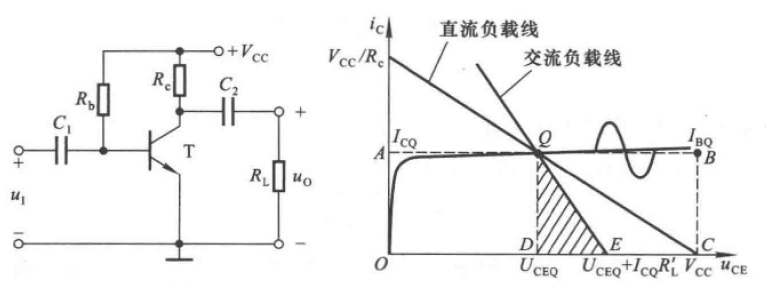
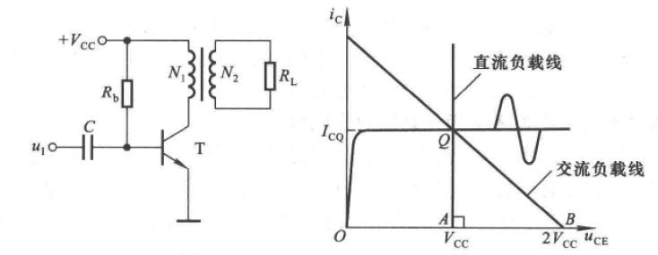
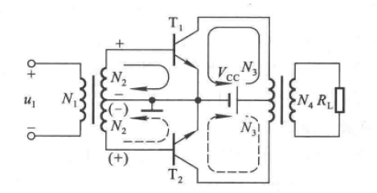
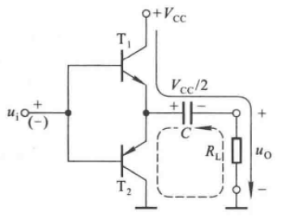
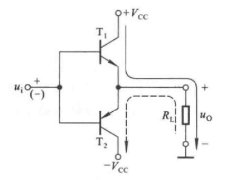
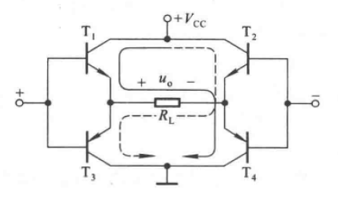
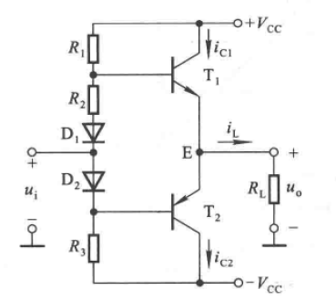

# 7.1 功率放大电路概述

## 7.1.1 功率放大电路的特点

### 一、主要技术指标

#### 1.最大交流输出功率

$\Large P_{om}$

#### 2.转换功率

$\Large \eta = {P_{om} \over P_直}$

#### 3.THD总谐波失真

### 二、晶体管

极限参数

### 三、分析方法

图解法

## 7.1.2 功率放大电路的组成

### 一、分类

#### 1.甲类

开通角度：360°

工作特点：波形保真，直流电源提供功率稳定不变

#### 2.乙类

开通角度：180°

工作特点：交越失真

#### 3.甲乙类

开通角度：180°-360°

#### 4.D类

开通角度：小于180°

工作特点：PWM脉宽调制

### 二、共射放大电路

工作状态：甲类

### 三、变压器耦合电路

#### 1.甲类耦合

#### 2.乙类推挽

### 四、无输出变压器电路(OTL)

静态时基极电压为$\large {V_{CC} \over 2}$，T1与T2对称，故电容上电压为$\large {V_{CC} \over 2}$

正半周时T1导通，组成射极输出器

负半周时T2导通，电容放电，组成射极输出器

电容**一定要大**，常选用几千微法的电解电容

### 五、无输出电容电路(OCL)

### 六、桥式推挽电路(BTL)

正半周时T1、T4导通

负半周时T2、T3导通

# 7.2 互补功率放大电路

## 7.2.1 OCL电路的组成

工作状态：甲乙类

## 7.2.2 输出功率及效率

$\Large U_{OM}={V_{CC}-U_{CES} \over \sqrt2}$

$\Large P_{OM}={U_{OM}^2 \over R_L}={(V_{CC}-U_{CES})^2 \over 2R_L}$

$\Large P_V={1 \over \pi} \int_{0}^{\pi} V_{CC} \cdot i_c(\omega t)d(\omega t)$

$\Large \eta = {P_{OM} \over P_V} = {\pi \over 4}\cdot {V_{CC}-U_{CES}\over V_{CC}} \approx 78.5\%$

## 7.2.3 晶体管的选择

最大管压降

最大耗散功率