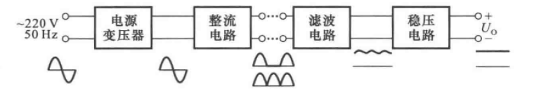
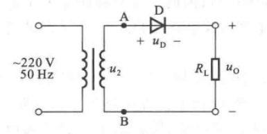
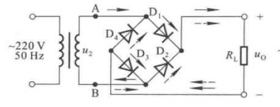
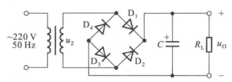
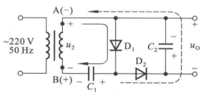
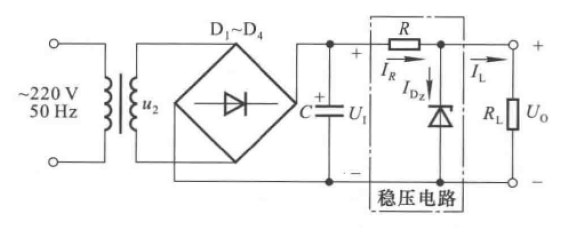
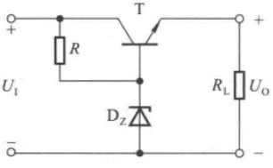
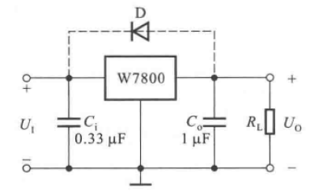
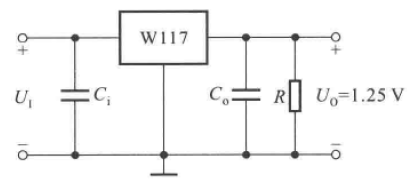
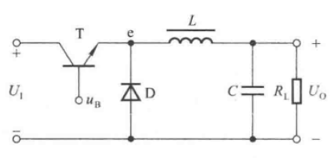

# 8.1 直流电源的组成及各部分的作用

# 8.2 整流电流

## 8.2.1 单相半波整流电路

### 一、工作原理

二极管单向导电性

### 二、主要参数

#### 1.平均电压

$\Large U_O(Average) ={1 \over 2\pi} \int_0^\pi \sqrt2sin\omega td(\omega t) \approx 0.45u_2$

#### 2.平均电流

$\Large I_O(Average) = {U_O \over R_L}$

决定二极管的$\large I_F$

#### 3.脉动系数

$\Large S={U_{O1M} \over U_O(Average)} \approx 1.57$

### 三、二极管的选择

1.$\large I_F > 1.1I_O$

2.$\large U_{Rmax} > 1.1\sqrt2 u_2$

## 8.2.2 单相桥式整流电路

### 一、工作原理

二极管单向导电性

### 二、主要参数

#### 1.平均电压

$\Large U_O(Average) ={1 \over \pi} \int_0^\pi \sqrt2sin\omega td(\omega t) \approx 0.9u_2$

#### 2.平均电流

$\Large I_O(Average) = 0.9{u_2 \over R_L}$

#### 3.脉动系数

$\Large S \approx 0.67$

### 三、二极管的选择

与单相半波整流电路**相同**

# 8.3 滤波电路

## 8.3.1 电容滤波电路

平均输出电压增大

脉动系数降低

性能受$\large R_LC$影响

## 8.3.2 倍压滤波电路

# 8.4 稳压管稳压电路

## 8.4.1 电路组成

## 8.4.2 稳压原理

电压发生变化导致$I_{DZ}$变化，从而导致$I_R$变化以补偿电压变化

## 8.4.3 性能指标

### 1.稳压系数

$\Large S_r = {{\Delta U_O \over U_O} \over {\Delta U_I \over U_I}}={\Delta U_O \over \Delta U_I} \cdot {U_I \over U_O} \approx {r_Z \over R} \cdot {U_I \over U_Z}$

R越大越稳定，$\large r_Z$越小越稳定

### 2.电压调整率

### 3.电流调整率

## 8.4.4 参数选择

### 1.输入电压

$\Large U_I = (2-3)U_O$

### 2.稳压管

$\Large U_Z=U_O$

$\Large I_{Zmax}-I_{Zmin} > I_{Lmax}-I_{Lmin}$

### 3.限流电阻

$\Large R_{max}={U_{Imin}-U_Z \over I_Z+I_Lmax}$

$\Large R_{min}={U_{Imax}-U_Z \over I_{ZM}+I_Lmin}$

# 8.5 串联型稳压电路

## 8.5.1 基本电路

电压串联负反馈稳定输出电压

$\Large U_I - U_O >U_{CES}$

## 8.5.2 集成稳压器

### 一、78系列三端稳压器

$C_i$：消除自激振荡

$C_O$：输出电阻，提高冲激电流

$D$：泄放二极管

### 二、W117基准电压

# 8.6 开关型稳压电路

